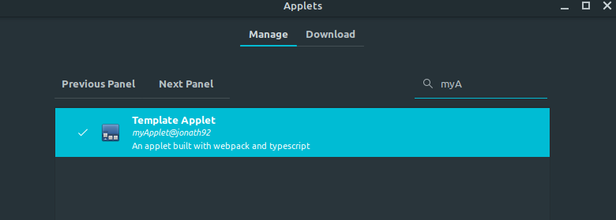

This repo can be used as a template to create linux mint applets with Typescript and webpack support (which allows to use node packages).

# Installation

1. Clone this repo into a folder with the name pattern `[appletName]@[authorName]` e.g. 

```
git clone git@github.com:jonath92/cinnamon-template-applet.git myApplet@jonath92
```

> :exclamation: The naming convention must be retained as the build process otherwilse won't work

2. change into the directory: `cd [appletName]@[authorName]`
3. Install the node dependencies `npm i`
4. Insall xdotool: `sudo apt install xdotool`
5. Build the applet `npm run build` 
6. Open the Applet Management Dialog and search for `[appletName]@[authorName]`

